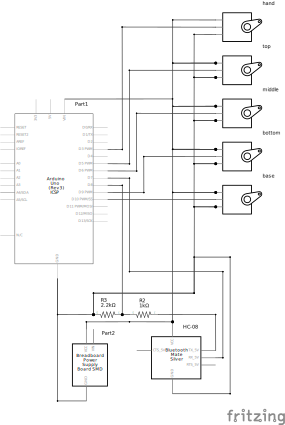
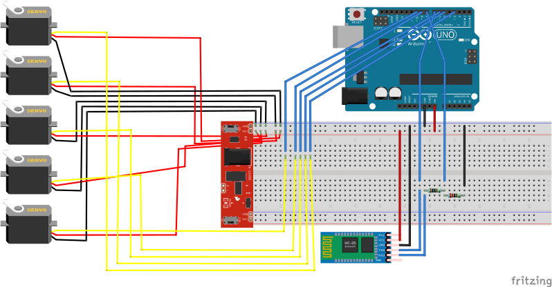

# Robotic Arm

A remoteley controlled robotic arm, using servo motors and the sciency dipduino.

## Requirements

### Hardware Assembly

- the robotic arm 3d print source files




### On the controlling device 

Install the bleak module on the host machine,

This should do. Or use the nix flake devshell.
```shell
pip install bleak
pip install mediapipe
```

Make sure you have tkinter installed.
Run controller.py, it will first connect to the arm then open an interface to control it from.

### On the arduino

Compile and upload the arduino.ino sketch

## [Licences](LICENSE.md)
