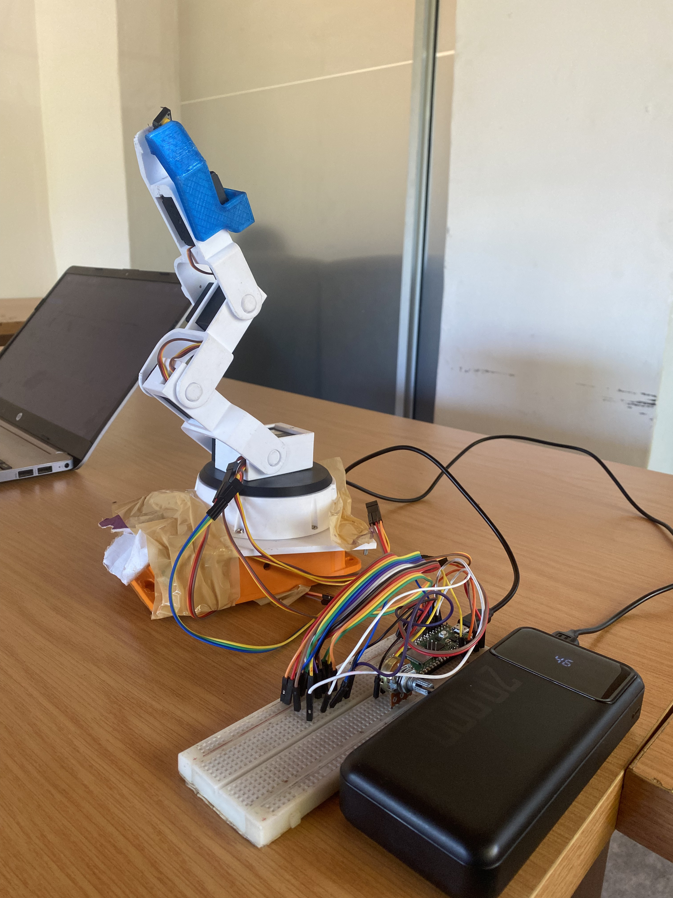
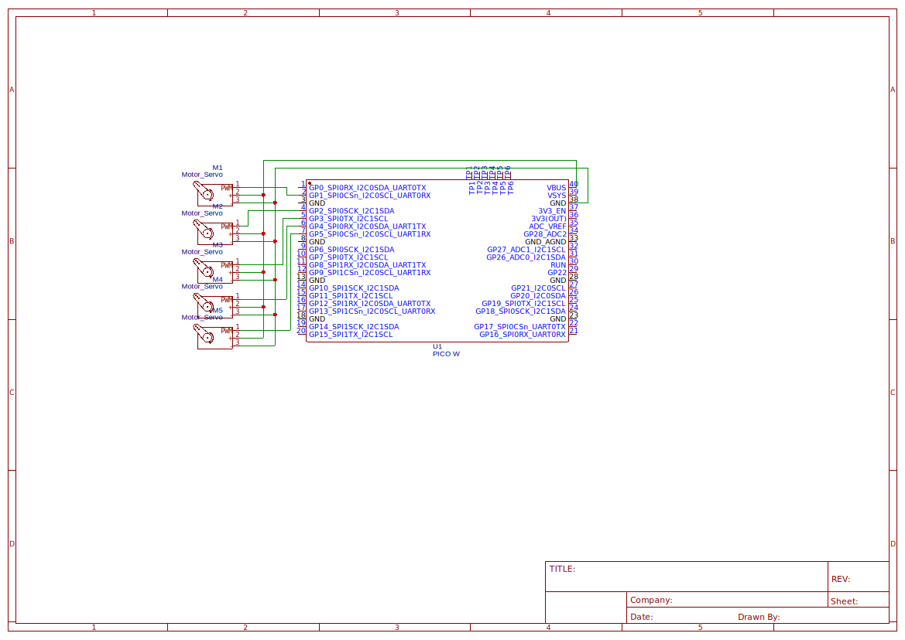

# Robotic Arm

A remoteley controlled robotic arm, using servo motors and the raspberry pi pico w.

## Requirements

### Hardware Assembly

- the robotic arm 3d print source files

### On the controlling device 

Ienstall the bleak module on the host machine,

`pip install bleak` should do

Make sure you have tkinter installed.
Run controller.py, it will first connect to the arm then open an interface to control it from.

### For the pico

upload ble_setup.py ble_advertising.py and main.py to the pico.
the ble code is from https://github.com/raspberrypi/pico-micropython-examples/tree/master/bluetooth

## [Licences](LICENSE.md)
